<div align="center">

# MicroShop

### One e-commerce application. Two architectures. Measured under load.

A final-year project comparing a **Node.js monolith** with an **event-driven microservices system**, through performance testing, fault injection, and message-queue analysis.

**React · TypeScript · Express · PostgreSQL · MongoDB · Redis · RabbitMQ · Docker · k6**

[Application](#application) · [Architecture](#architecture) · [Results](#results) · [Run locally](#run-locally) · [Experiments](#experiments)

</div>

---

## About the project

MicroShop implements the same e-commerce workflows in two backend designs to investigate how architecture affects response time, throughput, and resilience. Both applications provide account registration and login, product browsing, a shopping cart, orders, comments and reviews, recommendations, and AI-assisted product content.

The repository includes both React applications, their backends, Docker Compose environments, load generators, observability dashboards, and the saved measurements behind the result charts.

The central research question: **what changes when an application's shared backend is split into independent services with asynchronous messaging?**

## Application

Both implementations use a shared visual language so the same shopping workflows can be explored against different backends.

### Customer experience

Browse the catalogue, inspect a product, and manage quantities in the cart. These captures show the running microservices application with its existing seeded customer account and test catalogue. Product-image placeholders and load-test content are part of the application’s current demo data.

<p align="center">
  <a href="docs/screenshots/customer-product.jpg">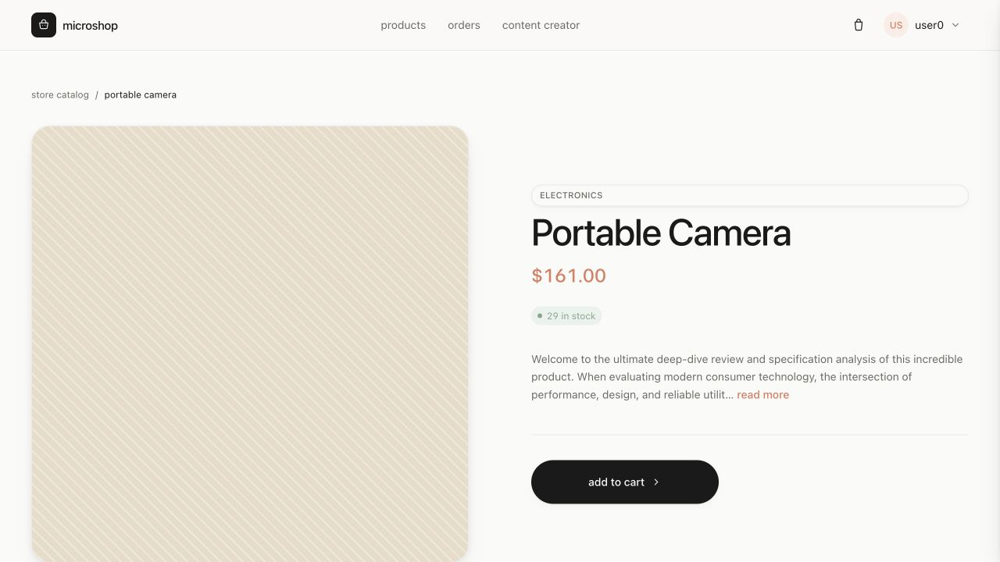</a>
</p>
<p align="center"><em>Product details · price, availability, description, and cart action</em></p>

<table>
  <tr>
    <th width="50%">Browse the catalogue</th>
    <th width="50%">Manage the cart</th>
  </tr>
  <tr>
    <td><a href="docs/screenshots/customer-catalogue.jpg">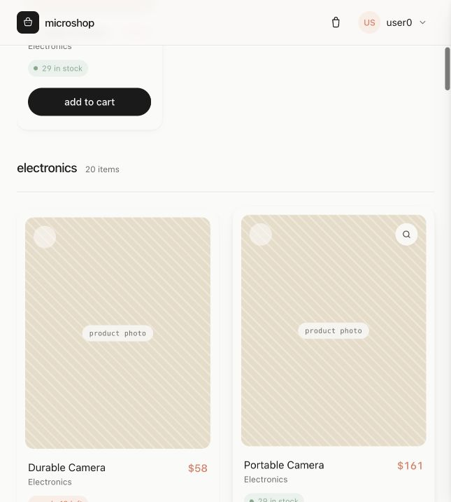</a></td>
    <td><a href="docs/screenshots/customer-cart.jpg">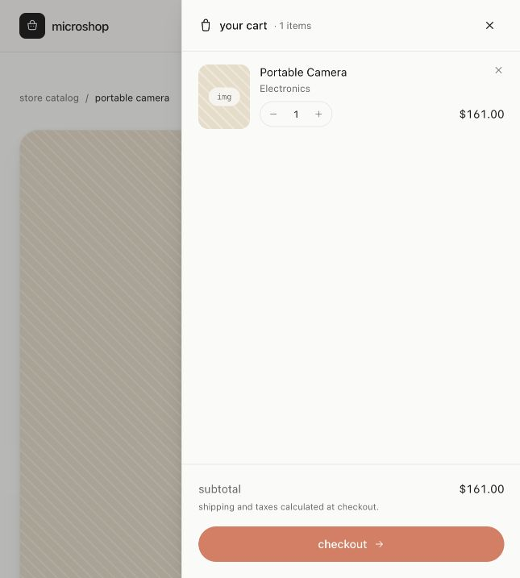</a></td>
  </tr>
</table>

<details>
<summary><strong>Account screens · sign in and registration</strong></summary>

<table>
  <tr>
    <th width="50%">Microservices · Sign in</th>
    <th width="50%">Monolith · Create account</th>
  </tr>
  <tr>
    <td><a href="docs/screenshots/microservices-login.jpg">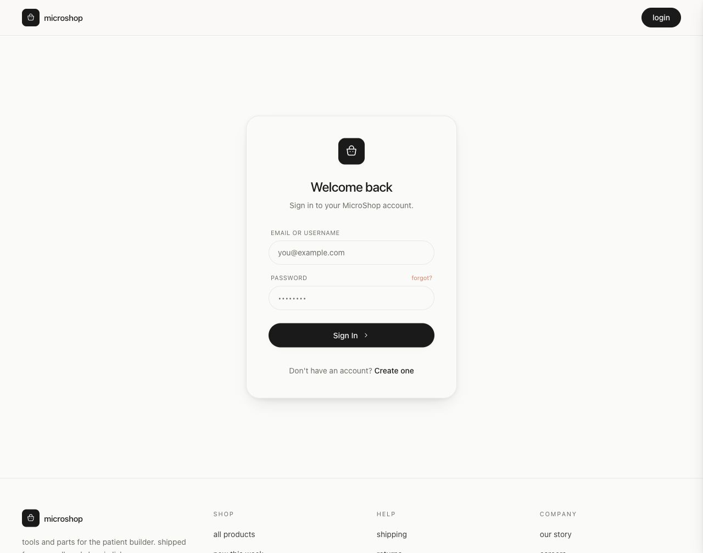</a></td>
    <td><a href="docs/screenshots/monolith-register.jpg">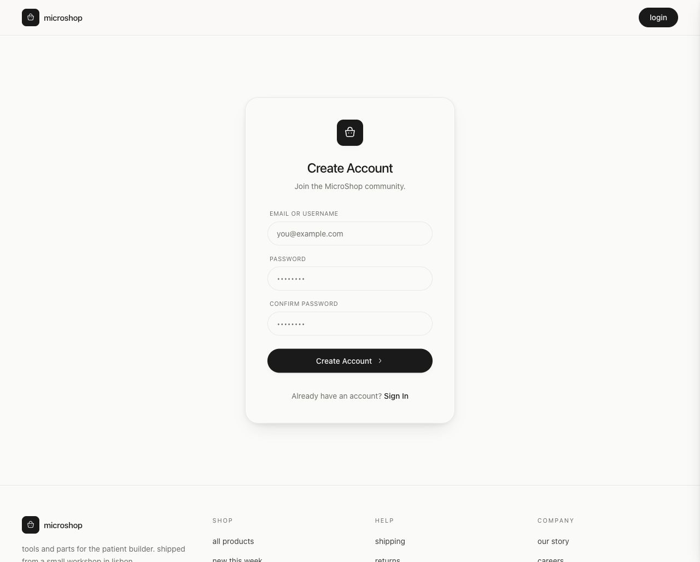</a></td>
  </tr>
</table>

</details>

*All screenshots are captured from the local applications and stored in this repository. Click an image to view it at full size. The dissertation charts below are the existing saved experiment figures.*

| Area | Capabilities |
| :--- | :--- |
| Shopping | Product catalogue, category filtering, product details, cart, and order history |
| Accounts | Registration, JWT authentication, and role-based administration |
| Content | Product publishing, comments, reviews, and Groq-powered text generation |
| Experiment controls | Traffic generation, content generation, and administrative views |
| Observability | Grafana dashboards, InfluxDB metrics, OpenTelemetry traces, and Jaeger |

## Architecture

| | Monolith | Microservices |
| :--- | :--- | :--- |
| Application boundary | One Express backend | API gateway with separate domain services |
| Persistence | PostgreSQL with Prisma | PostgreSQL with Prisma; MongoDB with Mongoose |
| Caching | Redis | Redis |
| Communication | In-process routing and direct database operations | HTTP between services and RabbitMQ events |
| Comment writes | Stored during request handling | Queued with `202 Accepted`, then processed asynchronously |
| Fault handling | Shared application process | Gateway circuit breaker for the LLM dependency |

### Monolithic deployment

<p align="center">
  <a href="diagrams/monolith.jpeg">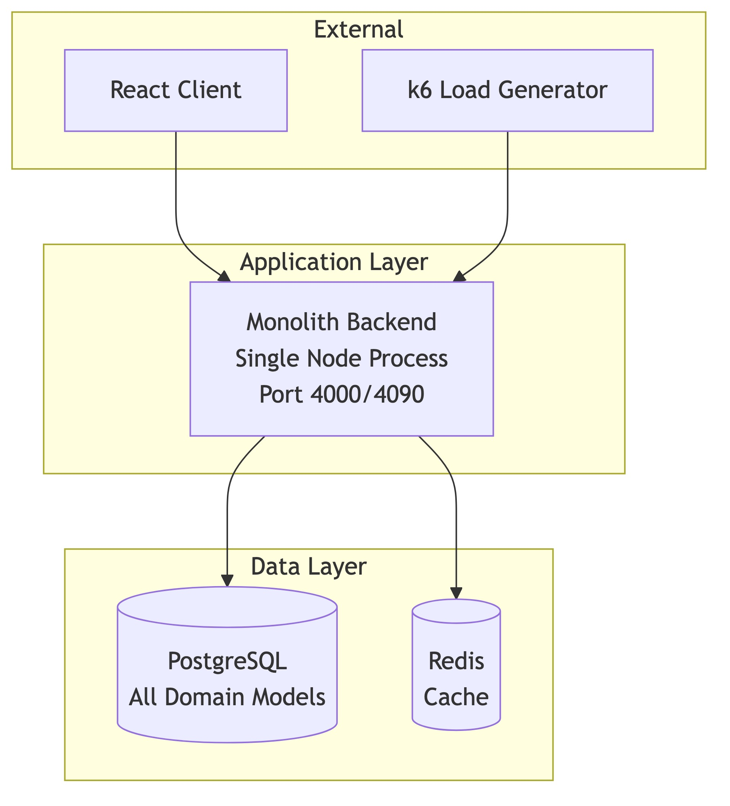</a>
</p>

### Microservices deployment

<p align="center">
  <a href="diagrams/microservices.jpeg">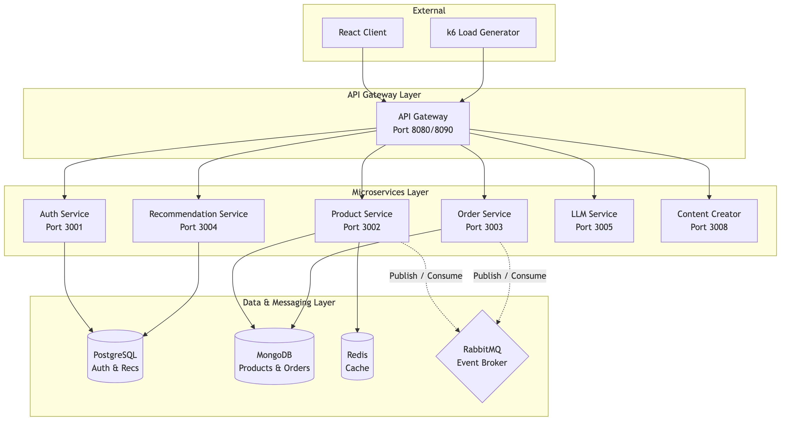</a>
</p>

The distributed implementation separates authentication, products, orders, recommendations, and LLM calls. Supporting services generate traffic and content. RabbitMQ carries comment and order events; OpenTelemetry and Jaeger expose request paths across services.

<details>
<summary><strong>View the interaction sequence diagram</strong></summary>

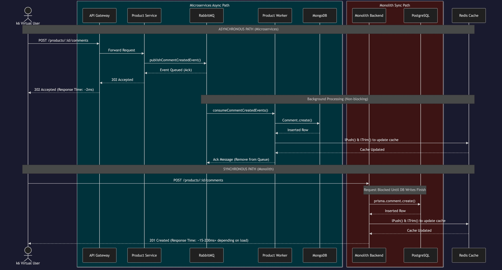

Editable diagram sources are available in [diagrams/](diagrams/).

</details>

## Results

The figures below are the existing project charts in [performance/results/charts/](performance/results/charts/), backed by the saved JSON summaries in [performance/results/](performance/results/). They describe the recorded runs of these implementations, rather than a universal ranking of monoliths and microservices.

### At a glance

| Saved run | Mean latency | p95 latency | Throughput | HTTP failure rate |
| :--- | ---: | ---: | ---: | ---: |
| Microservices · stress, 500 VUs | **67.5 ms** | **156.7 ms** | 182.1 req/s | 1.56% |
| Monolith · stress, 500 VUs | 262.4 ms | 985.3 ms | **243.6 req/s** | 1.71% |
| Microservices · write-heavy, 150 VUs | **156.9 ms** | **883.1 ms** | **318.9 req/s** | 0.00% |
| Monolith · write-heavy, 150 VUs | 335.2 ms | 1,056.6 ms | 203.7 req/s | 0.00% |

*VU = virtual user; p95 = the response time at or below which 95% of measured requests fall. Values are rounded from the aggregate k6 metrics.*

**What the saved runs show:** microservices achieved lower mean and p95 latency in both comparisons. The monolith delivered higher aggregate throughput in the stress run, while microservices delivered higher throughput in the write-heavy run. Both write-heavy runs recorded zero HTTP failures. Microservices also had higher maximum latency in both scenarios, so the improvement in typical latency did not remove slow outliers.

### 01 · Response time under stress

The stress scenario ramps to **500 concurrent virtual users** over a five-minute staged workload. The latency distribution shows the difference between typical responses and the slowest requests.

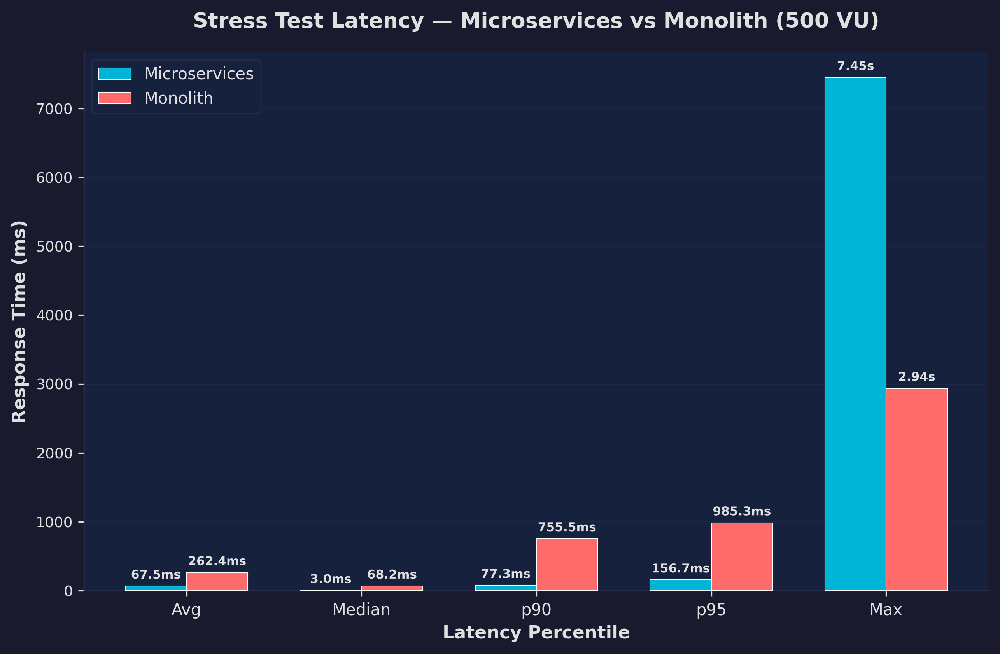

### 02 · Throughput and failures

Read throughput alongside latency: the saved monolith stress run handled more requests per second, despite its higher mean response time. HTTP failure rates were close, at approximately 1.6% and 1.7%.

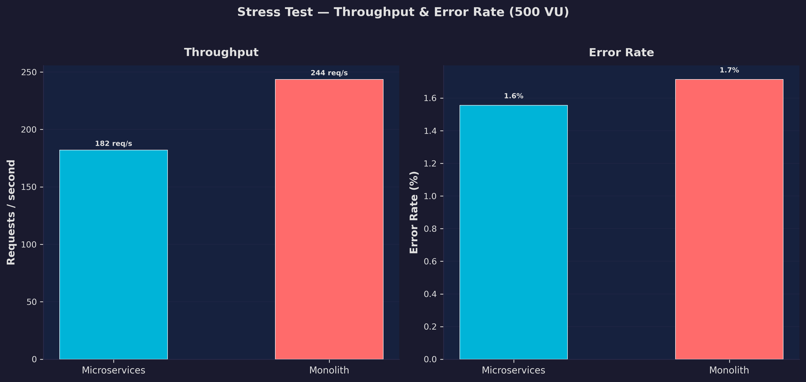

### 03 · Write-heavy workload

The one-minute demonstration workload peaks at **150 VUs per architecture** and excludes LLM calls. It exercises writes such as comments, orders, and reviews. The demo runner launches both architectures concurrently.

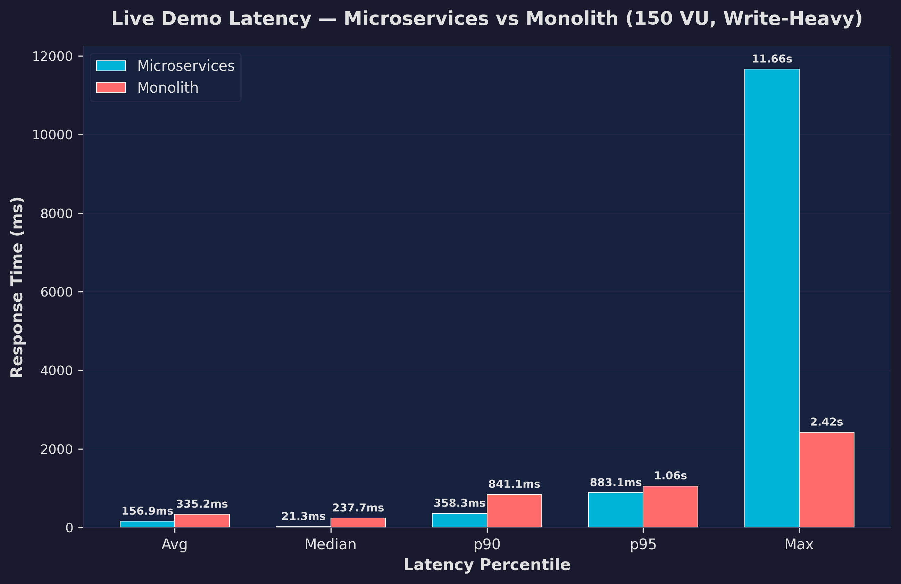

### 04 · Which checks passed?

The per-check breakdown adds context to aggregate HTTP metrics. Application checks and HTTP failure rates measure different things; an accepted HTTP response alone does not establish that all expected application behaviour succeeded.

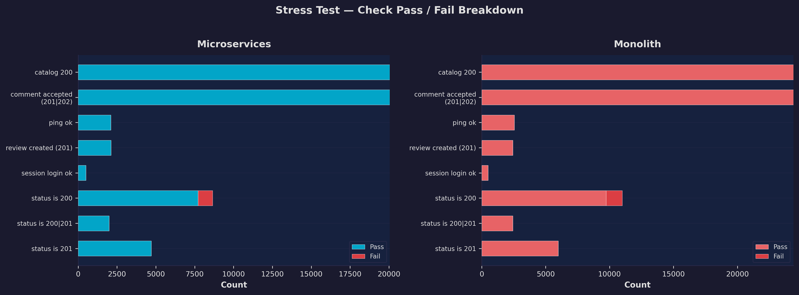

### 05 · Behaviour under an injected fault

The chaos experiment uses Pumba to inject a **five-second network delay into the LLM service** and exercises the gateway's circuit breaker. The saved chaos run recorded a mean response time of **469.4 ms**, a maximum of **15.22 s**, and an HTTP failure rate of **3.65%**.

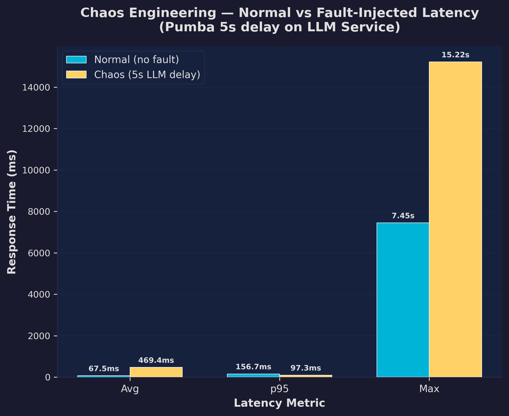

> **Comparison context:** this figure places the normal stress run, peaking at 500 VUs, beside a separate chaos workload capped at 100 VUs. It illustrates the recorded behaviour, but does not isolate the effect of fault injection under an identical load. A lower chaos p95 should not be interpreted as a performance improvement.

### 06 · Queue build-up and recovery

The RabbitMQ experiment records queue depth alongside publish and delivery rates through flood and drain phases. It complements HTTP latency by showing the work that remains after asynchronous requests have been accepted.

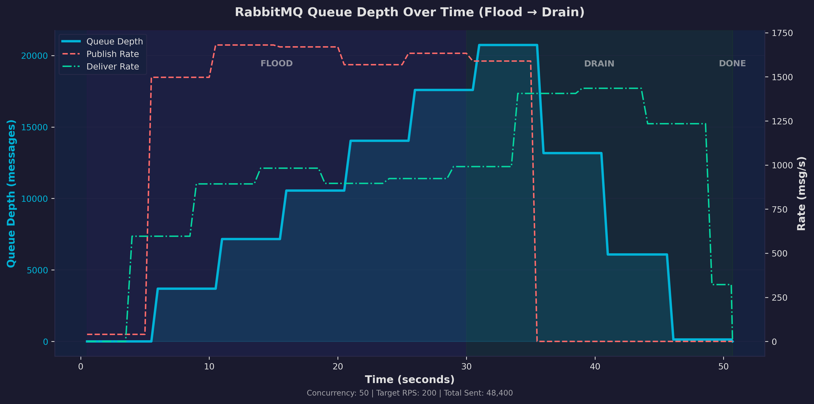

<details>
<summary><strong>07 · View the complete results summary</strong></summary>

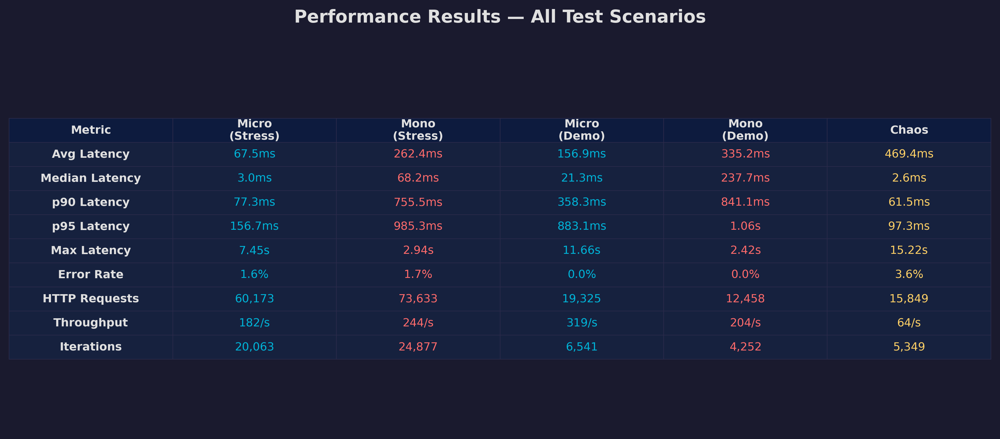

</details>

### Interpreting the comparison

These experiments compare complete implementations: database engines, service boundaries, and write semantics differ as well as deployment architecture. In particular, a queued `202 Accepted` response measures acceptance time, not completion of the database write. Queue draining and end-to-end completion therefore matter alongside request latency.

The stress runner executes the targets sequentially and stops the microservices application layer before the monolith run; the demo runs them concurrently on shared hardware. These are different experimental conditions. The saved summaries do not provide repeated-run confidence intervals or a complete hardware specification, so the figures should be treated as observations of these runs.

## Run locally

### Prerequisites

- Docker with Docker Compose.
- The environment files referenced by the Compose configurations: `monolith/backend/.env`, `microservices/api-gateway/.env`, and `.env` files in the auth, product, order, recommendation, and LLM service directories.
- Matching JWT configuration between the gateway and authentication service. Groq-backed features also require a `GROQ_API_KEY` in the LLM service and monolith backend environments.

On a fresh checkout, copy the supplied `.env.example` files to `.env` in their respective directories and fill in the required values. The Compose files supply container database addresses and several service settings. Review their `environment` and `env_file` entries before starting a fresh checkout. This is a local research environment with development defaults.

### Start the applications

From the repository root:

```bash
docker compose -f microservices/docker-compose.yml up -d --build
docker compose -f monolith/docker-compose.yml up -d --build
```

Once startup and database initialisation finish, check the APIs and seed the workload data:

```bash
curl -f http://localhost:8080/health
curl -f http://localhost:4000/health

# Microservices: products and test accounts
curl -X POST http://localhost:8080/products/seed
curl -X POST http://localhost:8080/auth/seed-users

# Monolith: products and test accounts
curl -X POST http://localhost:4000/seed
curl -X POST http://localhost:4000/auth/seed-users
```

| Interface | Local address |
| :--- | :--- |
| Microservices application | [localhost:5178](http://localhost:5178) |
| Monolith application | [localhost:5174](http://localhost:5174) |
| Microservices API gateway | [localhost:8080](http://localhost:8080) |
| Monolith API | [localhost:4000](http://localhost:4000) |
| RabbitMQ management | [localhost:15672](http://localhost:15672) |
| Jaeger traces | [localhost:16686](http://localhost:16686) |

The monolith frontend's Compose configuration uses the backend's additional listener on port `4090`; load tests target port `4000`.

### Start observability

```bash
docker compose -f performance/docker-compose.yml up -d
```

Open [Grafana](http://localhost:3000) for the provisioned dashboards or the [presentation dashboard](http://localhost:8087/presentation_dashboard.html) for the custom experiment view.

To stop the stacks while retaining named database volumes:

```bash
docker compose -f performance/docker-compose.yml down
docker compose -f monolith/docker-compose.yml down
docker compose -f microservices/docker-compose.yml down
```

## Experiments

| Experiment | Workload | Entry point |
| :--- | :--- | :--- |
| Stress comparison | Five-minute ramp to 500 VUs per target | [run-tests.sh](performance/run-tests.sh) / [loadtest.js](performance/loadtest.js) |
| Write-heavy demonstration | One minute, up to 150 VUs per target, concurrent runs | [run-demo.sh](performance/run-demo.sh) / [loadtest-demo.js](performance/loadtest-demo.js) |
| LLM fault injection | Five-second injected delay; up to 100 VUs | [run-chaos-test.sh](performance/run-chaos-test.sh) / [chaos-loadtest.js](performance/chaos-loadtest.js) |
| Queue flood and drain | Configurable duration, concurrency, and target rate | [queue-flood-test.js](performance/queue-flood-test.js) |

The shell runners contain machine-specific paths and Docker Compose executable locations. Adjust those before using them on another machine. Test runs create workload data and can overwrite saved summaries; preserve the existing results if you want to retain the figures shown here.

For a direct stress run with a locally installed k6, use the following from the repository root. These commands save fresh summaries separately from the dissertation results:

```bash
mkdir -p performance/results/local

k6 run --tag arch=microservices \
  -e ARCH=microservices -e TARGET_URL=http://localhost:8080 \
  --summary-export=performance/results/local/microservices.json \
  performance/loadtest.js

k6 run --tag arch=monolith \
  -e ARCH=monolith -e TARGET_URL=http://localhost:4000 \
  --summary-export=performance/results/local/monolith.json \
  performance/loadtest.js
```

These direct commands do not reproduce the runner's service-stop sequence. Add `--out influxdb=http://localhost:8086/k6` to each command to stream metrics into the running performance stack.

### Regenerate the existing charts

The chart generator reads the saved JSON files directly and writes seven PNGs to `performance/results/charts/`. It requires Python 3 and Matplotlib; running it replaces the existing chart images.

```bash
python3 -m venv /tmp/microshop-charts
/tmp/microshop-charts/bin/pip install matplotlib
/tmp/microshop-charts/bin/python performance/generate_charts.py
```

## Repository guide

```text
monolith/                 React client, Express backend, Prisma schema, Compose stack
microservices/            React client, API gateway, domain services, Compose stack
performance/              k6 workloads, experiment runners, dashboards, chart generator
  results/                Saved JSON measurements and chart images
diagrams/                 Architecture and sequence diagrams, with Mermaid sources
docs/screenshots/         Local application screenshots used in this README
tools/seeder/             Database seeding utilities
```

| Documentation | Contents |
| :--- | :--- |
| [Runbook](RUNBOOK.md) | Startup, seeding, logs, tracing, and experiment operations |
| [Performance testing guide](performance/README-testing.md) | Workload design and k6 usage |
| [System architecture notes](DISSERTATION_SYSTEM_ARCHITECTURE.md) | Dissertation design background and intended comparisons |
| [Technology overview](TECHNOLOGIES_USED.md) | Project stack and component roles |

Some supporting notes describe earlier workload sizes or expected outcomes. The current test scripts and saved result files are the basis for the measurements presented in this README.
